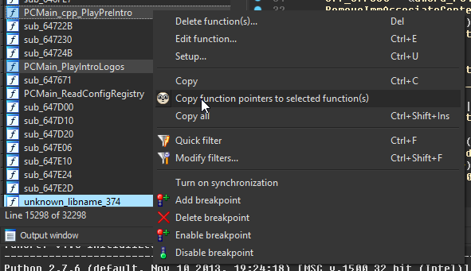

# ida_func_ptr for IDA Pro

## Overview

ida_func_ptr is a small utility plugin for [IDA Pro](https://www.hex-rays.com/products/ida/).
The plugin allows you to copy C function pointer definitions of functions through the context menus.

## Installation

Install Prefix into the IDA plugins folder.

- Copy the `ida_func_ptr.py` file into to the IDA plugins folder
    - On Windows, the folder is at `C:\Program Files (x86)\IDA 6.8\plugins`
    - On MacOS, the folder is at `/Applications/IDA\ Pro\ 6.8/idaq.app/Contents/MacOS/plugins`
    - On Linux, the folder may be at `/opt/IDA/plugins/`

The plugin has only been tested on IDA Pro 6.8 for Windows.
